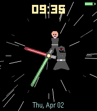

# Lightsaber Duel Watchface

A Star Wars-themed analog watchface for Pebble featuring Darth Vader and Luke Skywalker in a lightsaber duel, where the lightsabers serve as the clock hands.

## Prompts Used

This watchface was generated using the `pebble-watchface` skill with these prompts:

**Initial prompt:**
> make it so it's darth vader and luke skywalker fighting and their lightsabers are the hour and minute hands

**Refinement prompt:**
> make the characters slightly larger and higher resolution/more detailed

## Features

- **Lightsaber Clock Hands** — Vader's red lightsaber is the hour hand, Luke's green lightsaber is the minute hand
- **Lightsaber Glow Effects** — Colored glow behind each blade with white-hot core
- **Crossguards** — Perpendicular crossguard detail on each hilt
- **Detailed Vader Silhouette** — Angular helmet with faceplate and mouth grill, red eye lenses, chest control panel with colored buttons, flowing cape, belt with buckle
- **Detailed Luke Silhouette** — Blond hair, skin-tone face with eyes, dark vest over tunic, belt
- **Characters Follow Hands** — Vader and Luke are positioned at the base of their respective sabers, moving with the clock hands
- **Center Clash Dot** — Yellow/white dot at center where the duel happens
- **Star Field Background** — Scattered stars with varying brightness
- **Hour Markers** — Subtle tick marks, larger at 12/3/6/9
- **Digital Time** — Star Wars yellow text at top (LECO font)
- **Date** — Light blue text at bottom
- **Battery Indicator** — Color-coded bar (green/yellow/red)
- **Battery Efficient** — Updates on MINUTE_UNIT only

## Compatibility

| Platform | Display | Status |
|----------|---------|--------|
| Emery | Color 200x228 | ✅ Supported |

## Screenshots

### Emery (Pebble Time 2)


## Installation

### From Source
```bash
cd lightsaber-duel
pebble build
pebble install --emulator emery
```

## Technical Details

- **Update Rate**: MINUTE_UNIT (once per minute, battery efficient)
- **Memory Usage**: ~5KB RAM
- **Target Platform**: Emery (200x228)
- **Colors**: 64-color palette with glow effects

## Credits

Created with Claude Code using the pebble-watchface skill.
